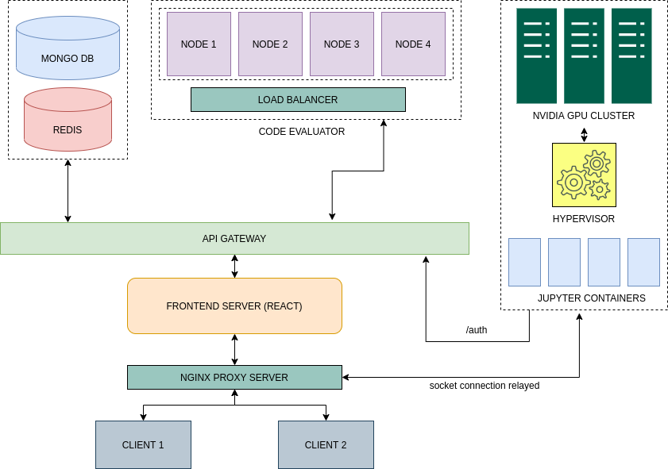

# Virtual Labs



## About

LNMIIT Virtual Labs was my final year BTech project performed in a team of 3 (me, Shubham and Jatin). The following repo contains
the features created by me, which mainly consists of the React frontend, the API Gateway, the file and authentication server.

I was also responsible for the initial system design of this project.

The other features wiz the Jupyter Lab cluster on NVIDIA DGX-1 and the Kubernetes cluster for the checker were created by the other
guys.

## How to Run?

- Make sure you have a running copy of [docker](https://docs.docker.com/engine/install/) and [docker-compose](https://docs.docker.com/compose/install/)

- Then run :

```
git clone -b production https://github.com/kingmanas/lnmiit-virtual-labs --depth 1
cd lnmiit-virtual-labs
docker-compose up
```
- The service is up at [https://localhost/8443](https://localhost:8443).

## Moving to AWS (Roadmap)

- The Authentication server can be replaced with AWS IAM authorization.

- MongoDB and Redis can be respectively replaced by AWS DynamoDB and AWS ElastiCache

- The core evaluation engine can be hosted on an EC2 instance.

- For the frontend server, we can support serverless rendering of the React app
  via AWS Lambda.

- The API Gateway can be replaced with AWS API Gateway.
